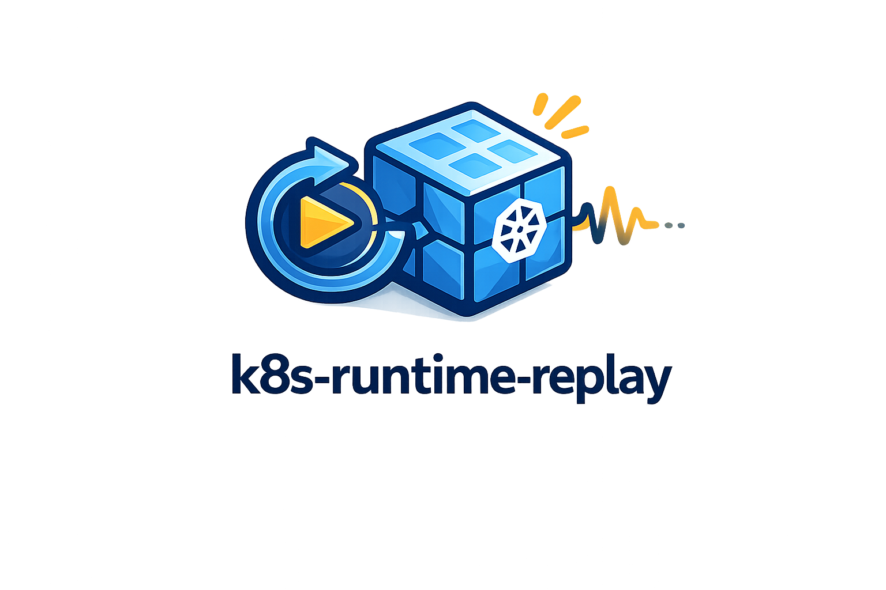

# k8s-runtime-replay

<p align="center">
  
</p>

**k8s-runtime-replay solves the problem of having no safe, repeatable way to trigger real Kubernetes runtime behaviors for testing detections, validating rules, and running security workshops.**

Instead of writing one-off scripts or guessing whether your Falco rules actually fire, you get a catalog of well-scoped scenarios — each a single `make` command that deploys a workload, triggers a real behavior, verifies it happened, checks for a detection alert, and cleans up after itself.

---

## How replay works

Each scenario follows the same deterministic flow: deploy a minimal workload → wait for readiness → trigger the behavior → verify the behavior was observed → optionally check for a detection alert → clean up. Behavior verification and detection verification are tracked and reported separately. A scenario passes when the behavior is confirmed, regardless of whether a detection tool is installed. Detection outcome is a second layer, not a prerequisite.

---

## Quick start

```bash
# 1. Create a local test cluster (requires kind + Docker)
make setup-kind

# 2. Run a scenario
make scenario-shell-spawn
```

**Example output:**

```
╔══════════════════════════════════════╗
║  scenario summary                    ║
╠══════════════════════════════════════╣
║  scenario            shell-spawn     ║
║  context             kind-k8s-replay ║
║  deploy              PASS            ║
║  ready               PASS            ║
║  trigger             PASS            ║
║  behavior            PASS            ║
║  detection backend   NOT INSTALLED   ║
║  detection           SKIP            ║
║  overall             SCENARIO PASS   ║
╚══════════════════════════════════════╝

Observed behavior:
  - shell executed inside workload container

Detection expectation:
  - alert for shell execution inside a container
  - exact rule name depends on local ruleset
```

---

## Scenario catalog

| Scenario | Behavior | Expected signal | Run |
|----------|----------|-----------------|-----|
| `shell-spawn` | Executes a shell inside a container | Shell execution in container | `make scenario-shell-spawn` |
| `sa-token-read` | Reads the mounted service account token | Sensitive file read in container | `make scenario-sa-token-read` |
| `kubectl-exec` | Triggers a `kubectl exec` audit event | Attach/Exec Pod audit event | `make scenario-kubectl-exec` |
| `curl-egress` | Makes an outbound HTTP request from a container | Unexpected outbound connection | `make scenario-curl-egress` |
| `secret-enumeration` | Lists Kubernetes Secrets from inside a container | K8s API contact from container | `make scenario-secret-enumeration` |

```bash
# List all available scenarios
make list-scenarios

# Run a specific scenario
make scenario-shell-spawn

# Run with JSON output
make scenario-shell-spawn JSON=1

# Reuse existing pod (skip redeploy)
make scenario-shell-spawn FAST=1

# Dry-run: print planned actions, no cluster changes
make scenario-shell-spawn DRY_RUN=1
```

> Expected signal names describe the *behavior*, not an exact detection rule name. Rule names vary by tool, ruleset version, and configuration. See each scenario's `README.md` for known variants.

---

## How it works

```
┌─────────────┐    deploy     ┌─────────────────┐
│   make run  │ ────────────► │  k8s workload   │
│  scenario   │               │  (k8s-replay ns)│
└─────────────┘               └────────┬────────┘
                                        │ trigger
                               ┌────────▼────────┐
                               │ behavior verify │ ──► PASS / FAIL
                               └────────┬────────┘
                                        │ (optional)
                               ┌────────▼────────┐
                               │ detection verify│ ──► PASS / SKIP / NOT VERIFIED
                               │   (Falco, etc.) │
                               └────────┬────────┘
                                        │
                               ┌────────▼────────┐
                               │ summary output  │ ──► human / JSON
                               └─────────────────┘
```

---

## CLI reference

### Scenario commands

```bash
make list-scenarios                     # list all scenarios with descriptions
make scenario-<name>                    # run a scenario (enforces clean state)
make scenario-<name> FAST=1            # reuse existing pod
make scenario-<name> JSON=1            # output result as JSON
make scenario-<name> DRY_RUN=1         # print what would happen, no cluster changes
```

### Setup

```bash
make setup-kind                         # create a local kind cluster
make setup-falco                        # install Falco via Helm (optional)
make doctor                             # check cluster, kubectl, namespace, backends
make doctor-falco                       # check Falco pod status and event source
```

### Cleanup

```bash
make cleanup-<name>                     # remove a specific scenario's workload
make cleanup                            # delete the k8s-replay namespace
make reset                              # full teardown including kind cluster
```

### Utilities

```bash
make logs-falco                         # filtered Falco alert view
make logs-falco-raw                     # raw Falco output (format debugging)
make list-rules                         # attempt to infer loaded Falco rule names
```

### Exit codes

| Code | Meaning |
|------|---------|
| 0 | Scenario passed, detection verified |
| 10 | Scenario passed, detection skipped (no backend installed) |
| 11 | Scenario passed, detection not verified |
| 20 | Preflight failed |
| 21 | Deploy failed |
| 22 | Readiness timeout |
| 23 | Trigger failed |
| 24 | Behavior not observed |

Exit codes 10 and 11 indicate the scenario succeeded. Detection outcome is separate from scenario success.

---

## Output format

Every scenario produces a fixed-format summary box followed by detail lines. The format is stable across runs and scenarios — CI and tooling can rely on it.

For machine consumption, use `JSON=1`:

```json
{
  "scenario": "shell-spawn",
  "context": "kind-k8s-replay",
  "environment_check": "pass",
  "deploy": "pass",
  "ready": "pass",
  "trigger": "pass",
  "behavior_verification": "pass",
  "detection_backend": "Falco",
  "detection_verification": "pass",
  "overall": "scenario_passed_detection_verified",
  "failure_reason": ""
}
```

---

## Deterministic runs

Every run enforces a clean state by default: the target pod is deleted and recreated before triggering. This guarantees that each execution starts from a known state and produces consistent, reproducible results. Use `FAST=1` only when you explicitly want to reuse an existing pod.

---

## Log verbosity

| Variable | Effect |
|----------|--------|
| `JSON=1` | Machine-readable JSON result instead of the summary box |
| `FAST=1` | Reuse existing pod, skip redeploy |
| `DRY_RUN=1` | Print planned actions without making cluster changes |
| `REPLAY_ALLOW_ANY_CLUSTER=true` | Bypass production cluster guard (not recommended) |

---

## Kubernetes requirements

| Requirement | Notes |
|-------------|-------|
| `kubectl` in PATH | Connected to a reachable cluster |
| Kubernetes 1.24+ | Tested against 1.29+ |
| RBAC enabled | Required for `sa-token-read` and `secret-enumeration` |
| Falco | Optional — detection verification only |
| `kind` + Docker | Required only for `make setup-kind` |
| `helm` | Required only for `make setup-falco` |

### Local vs cluster

- **Local (kind):** Use `make setup-kind` to create an isolated single-node cluster. Recommended for development, CI, and workshops.
- **Remote cluster:** Point `KUBECONFIG` at any test cluster. The production guard rejects contexts containing `prod`, `production`, `prd`, `live`, or `staging-prod`.

---

## Install

### Run directly (no install needed)

```bash
git clone https://github.com/topcug/k8s-runtime-replay
cd k8s-runtime-replay
make setup-kind
make scenario-shell-spawn
```

## Safe by design

- **No destructive actions** — scenarios never delete, modify, or exfiltrate real data.
- **Isolated namespace** — all workloads run in a dedicated `k8s-replay` namespace.
- **Full cleanup** — every scenario has a cleanup target that removes all resources.
- **Production guard** — scripts refuse to run if the current context looks like a production cluster.
- **Safety banner** — every trigger script prints a clear notice before doing anything.
- **Test clusters only** — these scenarios are designed for kind, minikube, or dedicated test clusters.

---

## Scenario structure

Every scenario follows the same layout:

```
scenarios/<name>/
  scenario.yaml       — machine-readable spec (id, trigger, behavior, detection)
  README.md           — goal, deployment, trigger, expected evidence, failure modes
  manifests/          — Kubernetes YAML (namespace, workload, RBAC)
  trigger.sh          — 7-phase execution engine
  cleanup.sh          — removes all scenario resources
```

---

## How to extend scenarios

To add a new scenario, follow the 7-phase trigger pattern and use the existing scenarios as templates. The full authoring guide is in [docs/scenario-authoring.md](docs/scenario-authoring.md).

**Checklist:**

1. Create `scenarios/<id>/scenario.yaml` with required fields
2. Create `scenarios/<id>/README.md` with required sections
3. Create `scenarios/<id>/manifests/` with workload YAML
4. Create `scenarios/<id>/trigger.sh` following the 7-phase pattern
5. Create `scenarios/<id>/cleanup.sh`
6. Add `make scenario-<id>` and `make cleanup-<id>` to `Makefile`
7. Add entry to `make list-scenarios`

Custom scenarios are drop-in. No plugin registration or framework changes needed — the execution engine reads `scenario.yaml` and runs `trigger.sh`.

---

## Sample detection use-case

A platform team wants to verify their Falco deployment fires on shell execution before going to production:

```bash
make setup-kind
make setup-falco
make scenario-shell-spawn

# In a second terminal
make logs-falco
```

The scenario exits 0 if a Falco alert is found, 11 if Falco is running but no match was found (rule may not be loaded), or 10 if Falco is not installed.

All three cases are non-destructive and fully cleaned up.

---

## Limitations

- Scenarios require a live Kubernetes cluster — there is no offline or mock mode.
- Detection verification is best-effort: it searches Falco logs by keyword and is sensitive to ruleset version and output format.
- The production guard is heuristic (context name matching) and can be bypassed with `REPLAY_ALLOW_ANY_CLUSTER=true`.
- Falco detection with `modern_ebpf` requires a Linux node with eBPF support. macOS kind nodes do not support eBPF drivers.
- `curl-egress` requires outbound internet access from the cluster. It fails gracefully in air-gapped environments.
- This tool generates runtime behaviors for testing purposes only. Never run on production clusters.

---

## Documentation

- [docs/local-cluster.md](docs/local-cluster.md) — setting up a local kind cluster
- [docs/falco-setup.md](docs/falco-setup.md) — installing and verifying Falco
- [docs/workshop-mode.md](docs/workshop-mode.md) — running as a structured workshop
- [docs/scenario-authoring.md](docs/scenario-authoring.md) — adding and extending scenarios
- [docs/advanced-usage.md](docs/advanced-usage.md) — JSON output, CI integration, dry-run, custom scenarios
- [docs/demo.md](docs/demo.md) — demo recordings and GIFs
- [CHANGELOG.md](CHANGELOG.md) — version history
- [CONTRIBUTING.md](CONTRIBUTING.md) — how to contribute

---

## Versioning

This project follows [Semantic Versioning](https://semver.org/). See [CHANGELOG.md](CHANGELOG.md) for release history.

---

## Roadmap

- [x] v0.1 — 5 core scenarios (shell-spawn, sa-token-read, kubectl-exec, curl-egress, secret-enumeration)
- [x] v0.2 — JSON output, exit code model, deterministic runs, dry-run mode
- [ ] v0.3 — `privileged-start` scenario, `verify.sh` per scenario
- [ ] v0.4 — asciinema recordings per scenario, demo GIF
- [ ] v1.0 — Falco rule mapping table, MITRE ATT&CK annotation, prebuilt binaries

---

## License

Apache 2.0 — see [LICENSE](LICENSE)
